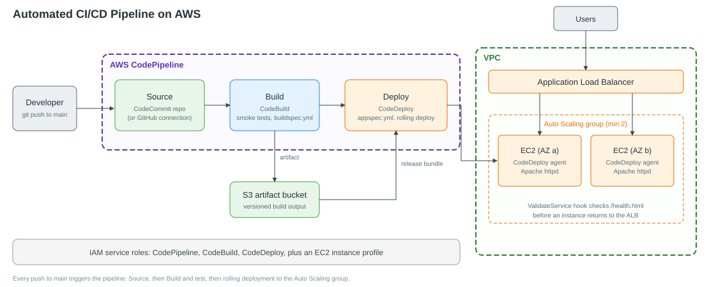

# Automated CI/CD Pipeline for Web Application Deployment on AWS

An end-to-end CI/CD pipeline that takes code from a Git repository, builds and tests it with **CodeBuild**, and deploys it with **CodeDeploy** to an **EC2 Auto Scaling group behind an Application Load Balancer**. **CodePipeline** orchestrates every stage, so a `git push` becomes a live deployment with no manual steps.

## Architecture



## Key Skills
CodeCommit · CodeBuild · CodePipeline · CodeDeploy · EC2 · ALB · Auto Scaling · IAM · S3

## Repository structure

```
.
├── app/                    # Static web app served by Apache httpd
│   ├── index.html
│   └── health.html         # ALB / validation health check target
├── scripts/                # CodeDeploy lifecycle hooks
│   ├── stop_server.sh
│   ├── install_dependencies.sh
│   ├── start_server.sh
│   └── validate_service.sh
├── tests/smoke_test.sh     # Runs in the CodeBuild pre_build phase
├── docs/architecture.svg   # Architecture diagram (PNG copy alongside)
├── buildspec.yml           # CodeBuild instructions
└── appspec.yml             # CodeDeploy instructions
```

## How it works

| Stage | Service | What happens |
|-------|---------|--------------|
| Source | CodeCommit | Pipeline triggers on every push to `main`. |
| Build | CodeBuild | Runs `tests/smoke_test.sh`, stamps a build version, packages the artifact to S3. |
| Deploy | CodeDeploy | Installs the release on every instance in the Auto Scaling group using `appspec.yml` hooks, then validates `/health.html`. |

## Setup guide

> **Note:** AWS no longer lets new customers create CodeCommit repositories. If your account is new, use **GitHub via an AWS CodeConnections (CodeStar) connection** as the Source stage. Everything else is identical.

1. **Network & compute**
   - Create a Launch Template using Amazon Linux 2023 and an instance profile with `AmazonSSMManagedInstanceCore` and `AmazonS3ReadOnlyAccess`.
   - Install the CodeDeploy agent via the launch template user data:
     ```bash
     #!/bin/bash
     dnf install -y ruby wget
     cd /tmp
     wget https://aws-codedeploy-<region>.s3.<region>.amazonaws.com/latest/install
     chmod +x install && ./install auto
     ```
   - Create a target group (HTTP:80, health check path `/health.html`), an ALB, and an Auto Scaling group (min 2, desired 2) attached to the target group.
2. **IAM roles**
   - CodeDeploy service role with `AWSCodeDeployRole`.
   - CodeBuild service role (logs + S3 artifact access).
   - CodePipeline service role (S3, CodeBuild, CodeDeploy, source access).
3. **CodeDeploy**: create an application (platform *EC2/On-premises*) and a deployment group targeting the Auto Scaling group, with the ALB target group enabled and `CodeDeployDefault.OneAtATime` as the deployment config.
4. **CodeBuild**: create a project using `buildspec.yml` (Amazon Linux standard image).
5. **CodePipeline**: create a pipeline with Source → Build → Deploy stages wired to the resources above.
6. Push a change to `main`, open the ALB DNS name, and watch the new version roll out.

## Rollbacks
Enable automatic rollback on deployment failure in the CodeDeploy deployment group. A failed `ValidateService` hook triggers a rollback to the last good revision.

## Possible improvements
- Define the whole pipeline in CloudFormation or Terraform.
- Add a manual approval stage before production.
- Blue/green deployment with a second target group.
- CloudWatch alarms and SNS notifications on pipeline failure.
- Replace the smoke test with unit and integration tests.

## Cleanup
Delete the pipeline, CodeDeploy application, Auto Scaling group, ALB, target group, launch template, and the S3 artifact bucket to avoid charges.
